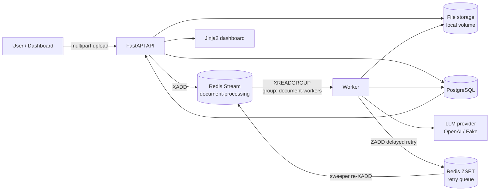
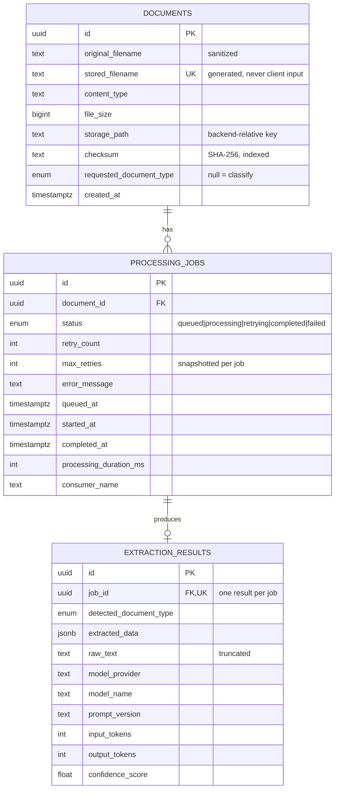

# Async AI Document Processing Pipeline

Upload a document, get structured data back. Uploads return immediately; the
extraction happens asynchronously on a separate worker fleet fed by a Redis
Stream, with retries, crash recovery and a status dashboard.

> Build status — Phase 8 of 8 complete. Portfolio demo: async upload to Redis
> Streams, separate workers, typed LLM extraction (OpenAI or fake), Postgres
> persistence, Jinja2 dashboard, Compose stack, and a single-EC2 Terraform
> bootstrap that reads `OPENAI_API_KEY` from SSM. Not a production deployment.
>
> Set `LLM_PROVIDER=openai` with `OPENAI_API_KEY` for model-backed extraction,
> or `LLM_PROVIDER=fake` for deterministic local runs with no API key and no
> cost. Tests always force the fake provider and clear the API key.

---

## 1. Project summary

A production-*style* pipeline that accepts PDF, DOCX and TXT uploads, classifies
each document, extracts a typed record from it with an LLM, and persists the
result to PostgreSQL. The API and the workers are separate processes that
communicate only through a durable Redis Stream, so ingestion stays fast and
available while extraction — which is slow, costly and failure-prone — is
retried and scaled independently.

## 2. Business use case

Back-office teams receive documents by email and re-key them into internal
systems by hand. The four supported types cover the common cases:

| Type | Extracted record | Consumer |
|---|---|---|
| Invoice | vendor, numbers, dates, totals, line items | Accounts payable |
| Resume | candidate, contact, skills, education, experience | Recruiting / ATS |
| Support ticket | subject, category, priority, sentiment, requested action | Support triage |
| Generic | title, summary, entities, dates, action items | Document search |

The properties that matter operationally: an upload is never lost because the
extractor is down, a slow LLM call never blocks the HTTP request, and every
document reaches a defensible terminal state — `completed` with a validated
record, or `failed` with a reason.

## 3. Architecture



## 4. Event processing sequence

```mermaid
sequenceDiagram
    participant C as Client
    participant A as API
    participant S as Storage
    participant D as PostgreSQL
    participant R as Redis Stream
    participant W as Worker
    participant L as LLM

    C->>A: POST /api/v1/documents
    A->>A: validate extension, MIME, size; sanitize name
    A->>S: write {uuid}.pdf, SHA-256 checksum
    A->>D: INSERT document + job(queued)
    A->>R: XADD document-processing
    A-->>C: 202 {document_id, job_id, status_url}

    W->>R: XREADGROUP as worker-{host}-{pid}
    W->>D: conditional UPDATE -> processing (0 rows = duplicate, ack & skip)
    W->>S: read file
    W->>W: extract text (empty -> non-retryable failure)
    opt document_type not supplied
        W->>L: classify from first 2k chars
    end
    W->>L: extract against the selected schema
    W->>W: validate with Pydantic
    W->>D: INSERT result + job(completed) in one transaction
    W->>R: XACK
```

`XACK` happens only after the transaction commits. A worker that dies mid-job
leaves its message in the pending entries list, where the recovery sweeper
reclaims it with `XPENDING` + `XCLAIM`.

## 5. Technology choices

| Area | Choice | Why |
|---|---|---|
| API | FastAPI + Uvicorn | Async-native, Pydantic validation and OpenAPI for free |
| Queue | Redis Streams | Durable log, consumer groups, acks, replay, visible backlog |
| Database | PostgreSQL + SQLAlchemy 2.x async + Alembic | Relational job tracking with JSONB for variable extraction shapes |
| Validation | Pydantic v2 | One schema drives the LLM's JSON schema, validation and the API response |
| LLM | OpenAI behind an `LLMProvider` interface | Swappable; a deterministic fake provider backs the test suite |
| PDF | `pypdf` | BSD-licensed; PyMuPDF is AGPL, which is a real constraint for a public repo |
| Logging | structlog | JSON lines with contextvar-bound `correlation_id` |
| Frontend | Jinja2 + vanilla JS | The dashboard is a table and a form; a SPA would be more build than product |
| Orchestration | Docker Compose | Postgres, Redis, migrate, API, worker |
| Infrastructure | Terraform | Repeatable, reviewable provisioning |

Deliberately excluded: Kubernetes, Kafka, Celery, RabbitMQ, and any frontend
framework. Each would add operational surface this project does not need, and
none would make the interesting parts — durable queuing, retries, idempotency —
any clearer.

## 6. Local setup

### Option A — Docker Compose (recommended)

Requires Docker. From a clean checkout:

```bash
cp .env.example .env   # optional; Compose defaults LLM_PROVIDER=fake
make up
```

That starts PostgreSQL, Redis, a one-shot `migrate` job, the API and a worker.
Open `http://127.0.0.1:8000/` for the dashboard or `/docs` for OpenAPI.

```bash
make logs    # follow all services
make down    # stop containers; volumes are kept
```

Under Compose, `DATABASE_URL` and `REDIS_URL` use hosts `postgres` and `redis`.
Uploaded files live in the `uploads` named volume, shared by API and worker.

### Option B — Local processes

Requires Python 3.12, [`uv`](https://docs.astral.sh/uv/), a local PostgreSQL
and a local Redis.

```bash
brew install redis && redis-server --daemonize yes
make setup
make db-create
make migrate
```

Then in two terminals:

```bash
make api
make worker
```

Set `DATABASE_URL` in `.env` to match your local server — the default assumes
`postgres:postgres@localhost:5432`.

## 7. Environment variables

Every setting is declared in [`app/core/config.py`](app/core/config.py) and
documented with its default in [`.env.example`](.env.example). Highlights:

| Variable | Default | Notes |
|---|---|---|
| `DATABASE_URL` | `postgresql+asyncpg://…/docpipeline` | Use host `postgres` under Compose |
| `REDIS_URL` | `redis://localhost:6379/0` | Use host `redis` under Compose |
| `LLM_PROVIDER` | `openai` | Set to `fake` to run the pipeline with no API key and no cost |
| `OPENAI_API_KEY` | _(unset)_ | Read from the environment only; never committed |
| `MAX_RETRIES` | `3` | Attempts before a job is marked `failed` |
| `MAX_UPLOAD_BYTES` | `10485760` | 10 MB |
| `ALLOWED_UPLOAD_EXTENSIONS` | `.pdf,.txt,.docx` | Anything else is rejected with HTTP 415 |

Secrets are typed as `SecretStr`, so they do not appear in a settings `repr`,
and the logging pipeline redacts credential-shaped keys independently.

## 8. API examples

Upload a document. The response is immediate; processing happens later.

```bash
curl -X POST http://localhost:8000/api/v1/documents \
  -F "file=@sample_documents/invoice.txt;type=text/plain" \
  -F "document_type=invoice"
```

```json
{
  "document_id": "71405955-08dc-4a7b-b445-c57c57520be9",
  "job_id": "6f588acc-9396-4d53-89be-56a83002a4e3",
  "status": "queued",
  "status_url": "http://localhost:8000/api/v1/jobs/6f588acc-9396-4d53-89be-56a83002a4e3"
}
```

Omit `document_type` to let the worker classify the document itself.

Poll the job. Once processing completes, `result` is populated and
`is_terminal` becomes `true`, which is the dashboard's signal to stop polling.

```bash
curl http://localhost:8000/api/v1/jobs/$JOB_ID
```

List jobs, newest first, optionally filtered:

```bash
curl "http://localhost:8000/api/v1/jobs?status=failed&limit=20&offset=0"
```

Fetch document metadata:

```bash
curl http://localhost:8000/api/v1/documents/$DOCUMENT_ID
```

Re-queue a failed job. Returns 409 unless the job is actually `failed`:

```bash
curl -X POST http://localhost:8000/api/v1/jobs/$JOB_ID/retry
```

Operational probes and metrics:

```bash
curl http://localhost:8000/health && curl http://localhost:8000/ready
curl http://localhost:8000/metrics-summary
```

### Error responses

Every non-2xx response uses one envelope:

```json
{
  "error": {
    "code": "unsupported_file_type",
    "message": "The file content does not look like a valid .pdf file.",
    "details": { "extension": ".pdf" },
    "correlation_id": "241875fd-c8bf-448a-9805-f4cb675cc8c2"
  }
}
```

| Status | When |
|---|---|
| 400 | Semantically invalid request |
| 404 | Unknown document or job ID |
| 409 | Illegal state transition, e.g. retrying a job that is not `failed` |
| 413 | Upload exceeds `MAX_UPLOAD_BYTES` |
| 415 | Extension, declared MIME type, or file signature is not supported |
| 422 | Request failed schema validation |
| 503 | A dependency is unreachable |

Pass `X-Correlation-ID` on any request and it is echoed on the response and
attached to every log line the request produces. Omit it and one is generated.

## 9. Dashboard usage

With the API running, open `http://127.0.0.1:8000/`. The page shows:

- live counts from `GET /metrics-summary` (job tallies, average duration,
  approximate success rate, jobs in the last 24 hours, Redis stream length,
  pending entries and scheduled retries)
- an upload form with an optional document-type selector
- a recent-jobs table that polls every `DASHBOARD_POLL_INTERVAL_MS`
- status badges, duration, detected type, failure message and a Retry button
  for failed jobs

Open any row for a job detail page with the extraction JSON pretty-printed.
Seed the four synthetic samples with:

```bash
make seed
```

## 10. Redis Streams design

Stream `document-processing`, consumer group `document-workers`, one consumer
name per worker process (`worker-{hostname}-{pid}-{short-uuid}`). Each message
carries a single `data` field holding the JSON event:

```json
{
  "event_id": "…",
  "event_type": "document.processing.requested",
  "event_version": 1,
  "job_id": "…",
  "document_id": "…",
  "storage_path": "…",
  "requested_document_type": "invoice",
  "attempt": 0,
  "created_at": "2026-07-29T14:31:07.412Z",
  "correlation_id": "…"
}
```

**Why Streams and not Pub/Sub.** Pub/Sub delivers to whoever happens to be
connected and then forgets. Restart a worker and every message published in
that window is gone, with no ack, no redelivery and no way to see a backlog.
Streams give a durable log, competing consumers within a group, per-message
acknowledgement, a pending entries list for recovering crashed consumers, and
`XLEN`/`XPENDING` for real queue metrics. An upload that vanishes because a
worker was restarting is not an acceptable failure mode.

## 11. Retry and failure behaviour

Failures are classified once, at the exception type, rather than at each call
site — see [`app/core/exceptions.py`](app/core/exceptions.py).

**Retryable:** LLM rate limits and timeouts, provider 5xx, transient Redis or
database errors, storage read errors.

**Not retryable:** unsupported file type, no extractable text, unparseable
document, malformed queue message, LLM authentication failure, and a response
that fails schema validation after the provider's single repair attempt.

On a retryable failure the worker marks the job `retrying`, schedules the event
in a Redis sorted set at `now + min(base · 2^attempt, cap)` with jitter, and
only then acks. A sweeper moves due events back onto the stream. Sleeping
inside the handler was rejected: it occupies a worker slot and loses the retry
if the process dies.

After `MAX_RETRIES`, or immediately on a non-retryable failure, the job becomes
`failed` with a structured error message. An operator can revive it with
`POST /api/v1/jobs/{id}/retry`, which is rejected with HTTP 409 unless the job
is actually in `failed` — that is what prevents two concurrent attempts.

Delivery is at-least-once; correctness comes from idempotent effects. A worker
claims a job with a conditional `UPDATE` that only matches `queued` or
`retrying` (or a `processing` row older than the stale threshold). A duplicate
delivery matches zero rows, gets acked and dropped, so a `completed` job is
never processed twice.

### Crash recovery

If a worker dies mid-job, its stream entry stays in the pending entries list
because the ack never happened. A sweeper in every worker runs `XPENDING` +
`XCLAIM` against entries idle for longer than `PENDING_MIN_IDLE_MS`, and the
job's `processing` row is re-claimable once `started_at` is older than
`STALE_PROCESSING_SECONDS`. Both thresholds exist so a *live* worker is never
robbed of work it is still doing.

`XPENDING` is used rather than the single-call `XAUTOCLAIM` because only it
reports how many times an entry has been delivered. That count is what
identifies a poison message that keeps killing whichever worker takes it; past
`MAX_DELIVERY_COUNT` the job is failed permanently instead of cycling through
the fleet forever.

### Poison messages

A stream entry whose payload cannot be decoded — malformed JSON, a missing
field, an `event_version` this consumer does not understand — is acknowledged
and dropped, with the reason logged. Redelivering it would achieve nothing: no
number of retries makes an unparseable payload parse.

### Shutdown

`SIGTERM` sets one `asyncio.Event`. Each loop finishes the event it is holding,
drives it to a durable outcome, acknowledges it, and only then exits. Nothing
is abandoned mid-flight, so a container can be replaced during a deploy without
stranding a document. Worst-case shutdown latency is roughly
`REDIS_BLOCK_MS`, since a loop parked in a blocking read cannot see the signal
until it returns.

## 12. Database schema



**Documents are append-only.** Everything mutable about a document lives on its
job, so the file and the metadata describing it can never drift apart.

**Indexes.** `(status, created_at)` serves the dashboard's "newest first,
filtered by status"; `(status, started_at)` serves the stale-job sweep;
`checksum` makes duplicate uploads identifiable. Timestamps are `timestamptz`
throughout — the application never produces a naive datetime.

**`max_retries` is copied onto each job** rather than read from configuration
at retry time, so changing the global default cannot alter the retry budget of
work already in flight.

**The unique constraint on `extraction_results.job_id`** is a database-level
guarantee that a job cannot accumulate two results. It backstops the worker's
idempotency check rather than replacing it.

Migrations live in `alembic/`. The initial revision creates the two PostgreSQL
enum types explicitly, because `document_type` is referenced by two tables and
an inline declaration would emit `CREATE TYPE` twice.

## 13. Testing

```bash
make test              # everything
make test-unit         # no external services needed
make test-integration  # requires PostgreSQL
```

Current state: 464 tests passing (plus one skipped when Docker is absent).

Unit tests need nothing running. Integration tests run against a real
PostgreSQL and a real Redis — doubles were rejected because the most
interesting behaviour under test is exactly what a double approximates worst:
conditional updates, constraint enforcement, consumer-group semantics, pending
entries and `XCLAIM` delivery counts. They **skip automatically** when neither
is reachable, so `make test` still works on a bare machine.

Each test gets its own randomly-named stream and consumer group, so runs cannot
interfere with each other or with a local dev Redis (tests use database 15).

The test database is brought to head with `alembic upgrade head` rather than
`metadata.create_all`, so the schema under test is the one that ships and a
broken migration fails the suite.

Override the connection when your local server differs:

```bash
make test TEST_DATABASE_URL=postgresql+asyncpg://me@localhost:5432/docpipeline_test
```

Tests always use the fake LLM provider. `tests/conftest.py` force-clears
`OPENAI_API_KEY` for every test, so the suite cannot make a paid call even on a
machine that has a real key configured.

## 14. Benchmark

```bash
make benchmark n=20
```

`scripts/benchmark.py` uploads N sample documents, polls until each job is
terminal, and prints submitted / completed / failed / timed_out counts, mean,
p50 and p95 end-to-end latency, and throughput per minute. Requires a running
API and worker. No latency numbers are published in this README until a run has
been recorded on a stated machine — capture your own results locally.

## 15. Terraform deployment

The [`terraform/`](terraform/) module provisions one EC2 instance in the default
VPC, installs Docker Compose via user data, clones this repository, reads
`OPENAI_API_KEY` from SSM Parameter Store, and starts the Compose stack.

This is a single-box portfolio demo. It is not highly available. Production
would use managed PostgreSQL and Redis, private networking, secret management,
load balancing and managed containers — see
[`terraform/README.md`](terraform/README.md).

SSH (22) and the API (8000) CIDRs are required variables with no
`0.0.0.0/0` default. Create the SSM parameter, copy the example tfvars, then:

```bash
cd terraform
cp terraform.tfvars.example terraform.tfvars
# set ssh_ingress_cidr, http_ingress_cidr, openai_ssm_parameter_name,
# git_repo_url, key_name

terraform init
terraform plan
terraform apply
terraform output dashboard_url
```

## 16. Security considerations

Implemented or planned for this portfolio project:

- Extension and MIME checks, a size cap, sanitized filenames, and generated
  storage names — user input never reaches a filesystem path.
- Secrets from the environment only, typed as `SecretStr`; `.env` is
  git-ignored and excluded from the Docker build context.
- Log redaction of credential-shaped keys plus a global 1,000-character value
  cap, so document text and API keys cannot reach the log stream.
- Parameterized SQL via SQLAlchemy throughout.
- Error responses carry a stable code, a safe message and a correlation ID —
  never a stack trace or internal detail.

**Known gaps, stated plainly:** the API and dashboard have **no
authentication**, so anyone who can reach the port can upload and read
documents. Uploaded documents may contain personal information and are stored
unencrypted on a local volume. Do not put real personal data through this
system.

## 17. Current limitations

- Compose and the Terraform EC2 demo are single-host: Postgres and Redis run
  beside the app, not as managed services. The box is not highly available.
- The upload path is not transactional across PostgreSQL and Redis. The job
  commits, then the event publishes. A crash between the two leaves a `queued`
  job nothing will deliver — visible in the API, recoverable with a manual
  retry, but not automatic. A publish that fails outright is handled: the job
  is failed immediately with a clear reason. The production answer is a
  transactional outbox, which is deliberately out of scope here.
- A retry that is popped from the delayed set but fails to publish is lost; the
  job stays `retrying` and needs a manual retry.
- No OCR: image-only PDFs produce no text and fail permanently.
- No chunking: documents are truncated to `LLM_MAX_INPUT_CHARS` before extraction.
- `confidence_score` is self-reported by the model and is not a calibrated
  probability. Treat it as a hint, not a measurement.
- One event in flight per worker process; scale by adding worker containers.
- No authentication, no rate limiting, no multi-tenancy.
- Demo Compose Postgres credentials are defaults suitable only for local use.

## 18. Production roadmap

Managed PostgreSQL (RDS) and Redis (ElastiCache) in private subnets; secrets in
Secrets Manager rather than instance environment; ECS or EKS instead of a single
EC2 box; S3 behind the existing storage interface; an ALB with TLS; OIDC or API
key auth; Prometheus metrics and OpenTelemetry traces alongside the current
structured logs; a real dead-letter stream with alerting; and OCR plus chunking
for documents this version cannot handle.

## 19. Resume bullets and interview questions

### Resume bullets (reproducible only)

Use only claims you can re-run on this repo:

- Built an async document pipeline in FastAPI where `POST /api/v1/documents`
  returns 202 and a separate worker consumes a Redis Stream to extract and
  persist results (run with `make up` or `make api` + `make worker`, then upload).
- Enforced at-least-once safety with a conditional job claim in PostgreSQL and
  `XACK` only after the extraction transaction commits (covered by integration
  tests under `tests/integration/test_worker.py`).
- Validated LLM output with four Pydantic extraction schemas and a swappable
  `LLMProvider` (OpenAI + deterministic fake); the suite clears `OPENAI_API_KEY`
  so tests never call the network.
- Shipped ops surfaces: Jinja2 dashboard, `GET /metrics-summary`, seed and
  benchmark scripts, Docker Compose, and Terraform for a single-EC2 demo that
  loads the API key from SSM.
- Quality gate: `make check` runs ruff, `mypy --strict` on `app/`, and pytest
  (464 tests passing in the last full run on this machine; re-run to confirm).

Do not quote end-to-end latency or throughput in a resume until you have run
`make benchmark` yourself and stated the machine.

### Five interview questions (project-specific)

1. Why Redis Streams instead of Pub/Sub?
   Pub/Sub forgets messages when no subscriber is connected. Streams keep a
   durable log, consumer groups, per-message acks, a pending entries list for
   crashed workers, and backlog metrics (`XLEN` / `XPENDING`). An upload that
   vanishes during a worker restart is unacceptable here.

2. Where is the idempotency barrier?
   In `job_service.claim_job`: a conditional `UPDATE` that only matches
   `queued` / `retrying`, or a stale `processing` row. Zero rows means a
   duplicate delivery; the worker acks and skips. `completed` has no outgoing
   transitions, so a finished job cannot be extracted twice.

3. Why acknowledge the stream message only after the database commit?
   If you `XACK` first and then crash before commit, the work is gone from the
   pending list but never persisted. Ack-after-commit leaves the message
   pending so reclaim can retry. The inverse loses jobs.

4. How are retries scheduled without sleeping in the handler?
   Retryable failures write the event into a Redis sorted set at
   `now + exponential backoff` (with jitter), then ack. A sweeper pops due
   members and re-`XADD`s them. Sleeping inside the handler would hold a worker
   slot and lose the retry if the process dies.

5. How do you treat LLM output?
   As untrusted input. Structured outputs are parsed into the schema for the
   document type; validation failure triggers one in-call repair attempt, then
   `LLMResponseValidationError` (not retryable at the job level). Fake-provider
   payloads are validated against the same schemas so schema drift fails tests.

### Repository layout

```text
.
├── Dockerfile.api
├── Dockerfile.worker
├── docker-compose.yml
├── Makefile
├── README.md
├── HANDOFF.md
├── pyproject.toml
├── alembic.ini
├── alembic/
├── app/
│   ├── api/           # FastAPI app, routes, dependencies
│   ├── core/          # settings, enums, exceptions, logging, time
│   ├── db/            # models, session, Alembic-facing metadata
│   ├── llm/           # provider interface, OpenAI, fake, prompts
│   ├── schemas/       # API and extraction Pydantic models
│   ├── services/      # storage, queue, jobs, metrics, validation
│   ├── static/        # dashboard CSS/JS
│   ├── templates/     # Jinja2 pages
│   └── worker/        # consumer, processor, recovery, retries
├── sample_documents/
├── scripts/           # seed.py, benchmark.py
├── terraform/         # single-EC2 demo module
└── tests/
    ├── unit/
    ├── integration/
    └── fixtures/
```

### Command cheat sheet

```bash
# Run (Compose)
make up && make seed

# Run (local processes)
make setup && make db-create && make migrate
make api          # terminal 1
make worker       # terminal 2

# Quality gates
make check TEST_DATABASE_URL=postgresql+asyncpg://USER@localhost:5432/docpipeline_test

# Benchmark (requires API + worker)
make benchmark n=20

# Terraform demo
cd terraform
cp terraform.tfvars.example terraform.tfvars   # edit required CIDRs and SSM name
terraform init && terraform plan && terraform apply
terraform output dashboard_url
terraform destroy
```

## Licence

MIT.
